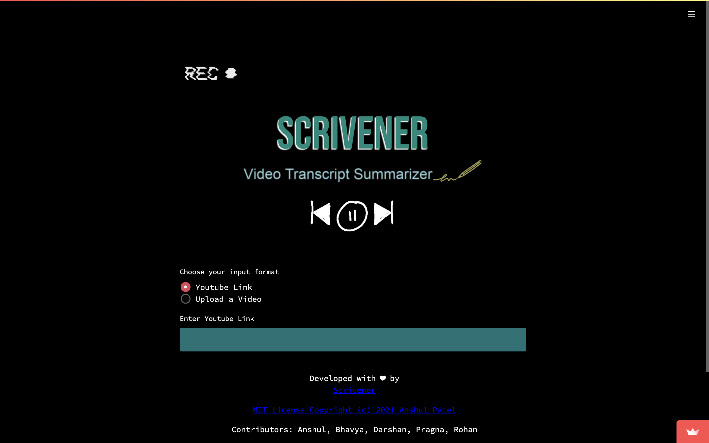
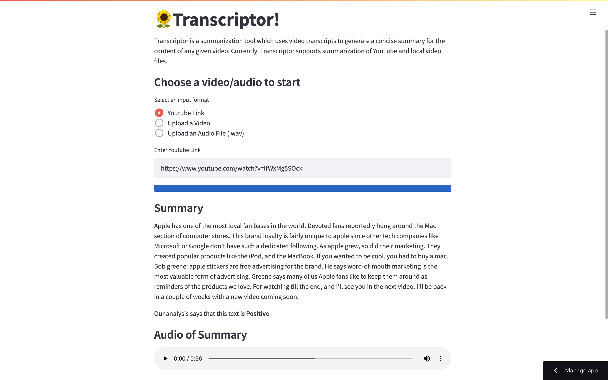

# Changes compared to V1 (Scrivener)

The team has worked on multiple facets of the project and has made significant changes to the code, documentation and overall usability of the original project. 

---

  <a href="#functionality">Functionality</a>
  ::
  <a href="#documentation">Documentation</a>
  ::
  <a href="#testing">Testing</a>
  ::
  <a href="#user-interface">User Interface</a>

---

## Functionality
The group has made the below mentioned functional changes to the project improving on the previous work.
1. **Audio Files:** This version added support for summarization of .wav audio files
2. **Sentiment Analysis:** The summary now is analyzed using Natural Language Processing and the sentiment is also returned.
3. **Summary Format:** The generated summary is now properly formatted
4. **Summary in the form of Audio:** The summary is now available in the form of Audio
5. **Code optimization:** Part of the codebase have been improved by removing repeating lines of code

## Documentation
Changes to the documentation were also significant. They are mentioned below.
1. **README:** The main README went through a total overhaul, and now follows a much more streamlined, colorful and impactful format
2. **Consistency:** Badges within the readme were all hardcoded and were not reflecting the actual state of the project. This has now been fixed to display the correct values consistently. 

## Testing
Testing has one of the biggest deltas in this update. The previous project was not executing any tests. In this update, tons of tests have been added to the project.
1. **Automated Tests:** Testcases are executed each time a push is made or a pull request is merged on main.
2. **Style checkers:** Style and format checkers have been added to Github Actions as well. This maintains the quality of the code in the project.

## User Interface
User Interface has been redone from the ground up to neatly navigate the user to the right places in the project. It follows a very simple and modern asthetic and it very intuitive to use. The before and after versions of the project website are respectively as shown below - 

  

  

